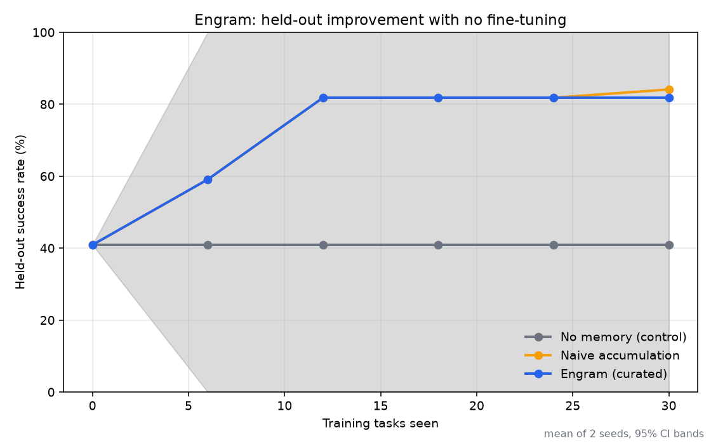

# Engram

An agent that gets better at a task over time by writing and curating its own memory,
with no fine-tuning and no weight updates. It attempts a task, a deterministic checker
(not an LLM) says pass or fail, the agent reflects on the attempt to extract a short
lesson, that lesson is curated into memory, and later attempts retrieve the relevant
lessons before trying again. Improvement is measured on a held-out set the agent never
learns from, so it reflects generalization, not memorization.

The domain here is text to SQL over a small SQLite database whose conventions are
undocumented (status stored as integer codes, a soft-delete flag you have to filter,
money stored in cents, unix-epoch dates, a category bridge table). The agent can only
learn these by getting a query wrong and reflecting on it.

## Result

Held-out success rate, averaged over 2 seeds, judged by the deterministic checker:

    no memory (control)     40.9 %
    naive accumulation      84.1 %
    engram (curated)        81.8 %

Honest read of this:

- Self-authored memory is worth about +41 points on tasks the agent never trained on.
  That is the main result and it is solid.
- Curated memory and naive "keep everything" memory tie on accuracy at this scale.
  With decent reflection, the memory never gets noisy enough (30 tasks, 5 conventions,
  2 seeds) for pruning and utility filtering to change the answer.
- Where curation does pay off here is size: it keeps memory to 6 lessons where naive
  grows to 9, by merging duplicates. And in an earlier, weaker-curation run, naive
  accumulation drifted back down from 73% to 59% as bad lessons piled up; adding
  utility-aware retrieval (stop retrieving lessons that have proven harmful) removed
  that decay. So curation is mostly insurance against memory rot, and its accuracy
  payoff should grow with longer runs and larger memory.

Everything replays offline from committed cassettes, so the numbers above reproduce
with no API key.

## Run it

    python -m venv .venv && source .venv/bin/activate
    pip install -r requirements.txt

    # reproduce the result offline, no key needed
    ENGRAM_LLM_MODE=replay python scripts/run_experiment.py

    # see the lessons the agent wrote for itself
    python scripts/inspect_memory.py

    # browse the curve and lessons
    streamlit run dashboard/app.py

To record fresh runs against the live API, put GEMINI_API_KEY in .env (see
.env.example) and run scripts/run_experiment.py. Default mode is auto: replay if a
cassette exists, otherwise call the model and record it.

## How it works

Training loop, per task:

    sample task -> retrieve lessons -> agent writes one SQL query -> checker: pass/fail
                -> reflect into a candidate lesson -> curate into memory

Evaluation runs the same loop on the held-out pool but read-only: it retrieves memory
and never writes back, so eval tasks are never learned from.

Curation is the part worth looking at. It uses two signals, embedding similarity and
measured utility, and does four things:

- dedup: a new lesson that is near-identical to an existing same-scope lesson gets
  merged instead of added.
- utility: every retrieval records whether the attempt then passed or failed. A
  lesson's utility is a smoothed helped-minus-hurt score. No LLM is in this path.
- consolidation: clusters of related lessons are merged into one principle that keeps
  the track record of its members.
- pruning: a lesson retrieved enough times with poor utility is removed. Retrieval
  also skips lessons that have already proven harmful.

The memory, reflection, curation, and eval code is domain-agnostic (see
engram/domains/base.py); the SQL database is a plug-in behind a small interface.

## Layout

    config.py                 model, seed, retrieval and curation thresholds, eval params
    engram/core/              gemini client (record/replay, rate limit, cost), attempt trace
    engram/memory/            lesson, store, retrieval, curation
    engram/agent/             attempt runtime, reflection
    engram/domains/           domain interface + the text-to-sql database and checker
    engram/eval/              training/eval harness, reporting
    scripts/                  run_experiment, inspect_memory, calibrate, smoke
    dashboard/app.py          streamlit view (offline, no key)
    cassettes/                recorded LLM calls, committed for offline replay

## Limits and honesty

- One domain, one small illustrative database. This is a demonstration of the
  mechanism, not a product.
- Utility credit is coarse: when several lessons are retrieved together, the outcome
  is credited to all of them. It is meaningful in aggregate, not per attempt.
- With only pass/fail feedback and no ground truth, some conventions are hard for the
  agent to guess (it rarely learns the cents rule, for example). The curve reflects
  that honestly.
- Two seeds gives wide confidence intervals, so the engram-vs-naive accuracy gap is
  not statistically distinguishable. More seeds would tighten it.
- Dedup is scope-exact, so the same rule filed under different scopes can survive as a
  near-duplicate. Visible in inspect_memory.

Reflection and memory-augmented agents are established ideas. What this repo adds is a
small, reproducible setup with a deterministic checker, a held-out measurement, and a
utility-based curation mechanism you can inspect and argue with.
